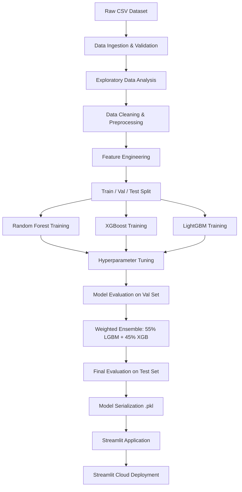
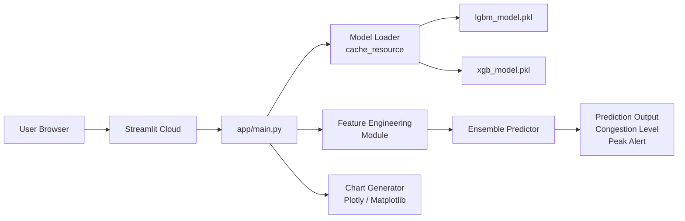
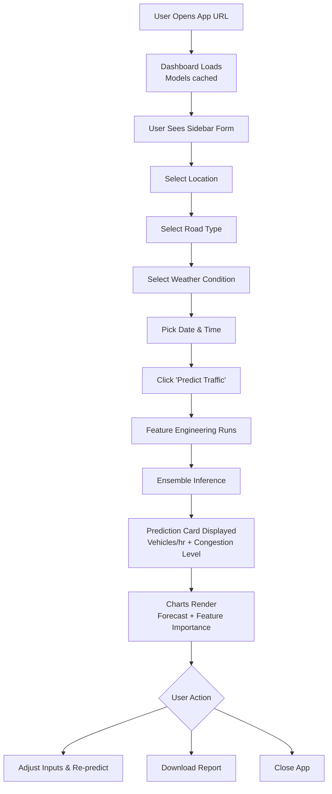

# Product Requirements Document (PRD)

## Traffic Demand Prediction Using LightGBM and XGBoost

**Document Version:** 1.0  
**Prepared By:** Innovexa Catalyst — ML Engineering Team  
**Date:** June 2026  
**Status:** Approved for Development

---

## Table of Contents

1. [Executive Summary](#1-executive-summary)
2. [Problem Statement](#2-problem-statement)
3. [Goals](#3-goals)
4. [Project Scope](#4-project-scope)
5. [Stakeholders](#5-stakeholders)
6. [Functional Requirements](#6-functional-requirements)
7. [Non-Functional Requirements](#7-non-functional-requirements)
8. [Dataset Description](#8-dataset-description)
9. [Machine Learning Pipeline](#9-machine-learning-pipeline)
10. [Data Preprocessing Strategy](#10-data-preprocessing-strategy)
11. [Feature Engineering Strategy](#11-feature-engineering-strategy)
12. [Exploratory Data Analysis](#12-exploratory-data-analysis)
13. [Model Development](#13-model-development)
14. [Hyperparameter Tuning](#14-hyperparameter-tuning)
15. [Ensemble Learning](#15-ensemble-learning)
16. [Model Evaluation](#16-model-evaluation)
17. [Expected Performance](#17-expected-performance)
18. [Deployment Architecture](#18-deployment-architecture)
19. [User Experience](#19-user-experience)
20. [Dashboard Requirements](#20-dashboard-requirements)
21. [File Structure](#21-file-structure)
22. [Risks & Mitigations](#22-risks--mitigations)
23. [Future Enhancements](#23-future-enhancements)
24. [Deliverables](#24-deliverables)
25. [Development Roadmap](#25-development-roadmap)
26. [Acceptance Criteria](#26-acceptance-criteria)

---

## 1. Executive Summary

### Project Overview

The **Traffic Demand Prediction System** is an end-to-end machine learning solution that forecasts vehicular traffic demand at specific road segments, times, and weather conditions within a smart city environment. The system ingests 120,000+ historical records combining traffic, weather, road, and location data to train gradient boosting models (LightGBM and XGBoost) and serve predictions through an interactive Streamlit web application.

### Business Problem

Urban traffic congestion costs cities billions annually in lost productivity, increased fuel consumption, and infrastructure degradation. Traffic management authorities and city planners currently lack accessible, accurate, real-time demand forecasting tools, resulting in reactive—rather than proactive—traffic management.

### Proposed Solution

A supervised regression ML pipeline that:
- Ingests and preprocesses structured city traffic data
- Engineers domain-specific features (rush hour flags, weather impact scores, etc.)
- Trains and tunes LightGBM, XGBoost, and Random Forest models
- Combines the two best models via weighted ensemble (55% LightGBM + 45% XGBoost)
- Deploys predictions through a Streamlit web dashboard accessible to traffic planners and city operators

### Expected Outcome

An industry-grade Traffic Demand Prediction System achieving **R² ≥ 0.96** on held-out test data, deployed on Streamlit Cloud with sub-2-second prediction latency.

### Success Criteria

| Criterion | Target |
|---|---|
| Ensemble R² Score | ≥ 0.96 |
| RMSE | Below baseline naive model |
| Prediction Latency | < 2 seconds |
| Streamlit App Uptime | ≥ 99% during demo period |
| Code Coverage (Tests) | ≥ 70% |
| Model File Size | < 500 MB total |

---

## 2. Problem Statement

### Why Traffic Prediction Matters

Urban mobility is the backbone of economic productivity. As cities grow denser, traffic networks become increasingly strained. Predicting demand before it peaks enables authorities to pre-position resources, adjust signal timings, and reroute vehicles—turning reactive management into proactive planning.

### Current Challenges

- **Reactive Management:** Most traffic systems respond to congestion after it forms, not before.
- **Siloed Data:** Weather, event, and road data exist in separate systems with no integrated prediction layer.
- **Inaccurate Heuristics:** Static peak-hour models don't account for weather, events, or anomalies.
- **Accessibility Gap:** Sophisticated forecasting tools require expensive proprietary software inaccessible to mid-tier city authorities.

### Problems Solved by Machine Learning

| Challenge | ML Solution |
|---|---|
| Nonlinear traffic patterns | Gradient boosted trees capture complex feature interactions |
| Weather-traffic correlations | Engineered weather impact scores |
| Rush hour variability | Temporal flags and interaction features |
| Event-driven demand spikes | Event indicator feature encoding |
| Multi-location prediction | Geohash-encoded location features |

### Business Value

- Reduce peak congestion by enabling pre-emptive signal adjustments
- Decrease average commute time through smarter routing recommendations
- Reduce fuel consumption and emissions via optimized flow
- Provide data-driven justification for infrastructure investments

### Real-World Use Cases

1. **Traffic Control Centers** — Anticipate congestion spikes and adjust signal timings
2. **Municipal Planning Departments** — Identify chronically underserved road segments
3. **Logistics Companies** — Schedule last-mile delivery during low-demand windows
4. **Event Organizers** — Model expected traffic impact of large public gatherings
5. **Emergency Services** — Pre-position units in low-congestion windows

---

## 3. Goals

### Business Goals

- Reduce average peak-hour congestion by providing 2-hour demand forecasts
- Enable data-driven road infrastructure planning using historical demand patterns
- Provide a publicly accessible prediction interface for city planners and operators
- Demonstrate commercial viability of ML-based traffic forecasting as a product

### Technical Goals

- Achieve ensemble R² ≥ 0.96 and RMSE below the naive baseline on held-out test data
- Maintain prediction latency under 2 seconds per request on Streamlit Cloud
- Build a fully reproducible ML pipeline with version-controlled models and datasets
- Ensure modular, maintainable codebase enabling straightforward retraining on updated data
- Support horizontal scaling of the prediction API for future production deployment

---

## 4. Project Scope

### In Scope

- Ingestion, validation, and preprocessing of the Smart City Traffic Dataset (120,000+ records)
- Exploratory Data Analysis (EDA) with 6+ visualizations
- Feature engineering pipeline (5 domain-specific engineered features + geohash encoding)
- Training and evaluation of Random Forest, XGBoost, and LightGBM regressors
- Hyperparameter tuning using Random Search and Grid Search
- Weighted ensemble model (55% LightGBM + 45% XGBoost)
- Model persistence as `.pkl` files
- Streamlit web application with user input form and prediction dashboard
- Deployment to Streamlit Cloud
- Git repository with documentation and README
- Project report and 5–10 minute demo video

### Out of Scope (Version 1)

- Real-time data ingestion from live traffic sensors or APIs
- Live weather API integration (OpenWeatherMap or similar)
- Route recommendation engine
- Accident risk or incident prediction
- Deep learning models (LSTM, Transformer)
- Mobile application
- Multi-city or multi-dataset generalization
- Role-based access control or user authentication
- Automated MLOps retraining pipeline

---

## 5. Stakeholders

| Role | Responsibility |
|---|---|
| **ML Engineer** | Designs and implements the training pipeline, hyperparameter tuning, and ensemble logic |
| **Data Scientist** | Conducts EDA, feature engineering, and model evaluation; interprets results |
| **Software Engineer** | Builds the Streamlit application, file structure, and deployment workflow |
| **Product Owner** | Defines requirements, prioritizes features, and validates acceptance criteria |
| **End User (Traffic Planner)** | Uses the Streamlit app to obtain traffic demand predictions for planning decisions |
| **City Traffic Authority** | Domain expert providing context for feature interpretation and business requirements |
| **QA Engineer** | Writes and executes tests for preprocessing, model outputs, and application flows |
| **DevOps / Cloud Engineer** | Manages Streamlit Cloud deployment and environment configuration |

---

## 6. Functional Requirements

### 6.1 Dataset Upload

- The system shall accept the Smart City Traffic Dataset as a CSV file.
- The upload interface (in development/notebook mode) shall validate file type and schema on load.
- A sample dataset preview (first 10 rows) shall be displayed after successful ingestion.

### 6.2 Data Validation

- The system shall check for the presence of all 15 required feature columns.
- Missing column detection shall raise a descriptive `ValueError` with the list of absent columns.
- Data type validation shall flag columns with unexpected types (e.g., numeric in a categorical column).
- Row count validation shall warn if the dataset has fewer than 1,000 records.

### 6.3 Data Cleaning

- Null values shall be imputed using strategy appropriate to column type:
  - Numeric: median imputation
  - Categorical: mode imputation
- Duplicate rows shall be detected and removed, with a count logged.
- Outliers in `Traffic Demand` (target) and numeric features shall be identified using IQR; rows beyond 3× IQR shall be flagged and optionally removed.
- Datetime columns shall be parsed and validated for format consistency.

### 6.4 Feature Engineering

The pipeline shall generate the following engineered features (detailed in Section 11):
- `hour_flag` — categorical time-of-day segment
- `weekend_flag` — binary weekend indicator
- `traffic_density_score` — composite density metric
- `weather_impact_score` — numeric weather severity index
- `rush_hour_indicator` — binary peak-hour flag
- Additional features: `day_of_week`, `month`, `hour_sin`, `hour_cos`, `lane_signal_interaction`

### 6.5 Model Training

- The system shall split data into train (70%), validation (15%), and test (15%) sets using stratified sampling on `hour_flag`.
- Three models shall be trained: Random Forest Regressor, XGBoost Regressor, LightGBM Regressor.
- All training runs shall be logged with timestamp, hyperparameters, and metrics.
- Random seed shall be fixed at `42` for reproducibility.

### 6.6 Hyperparameter Tuning

- Random Search shall be applied first (50 iterations, 5-fold CV) to identify promising regions.
- Grid Search shall refine the top candidate configuration.
- Best parameters shall be saved to `models/best_params.json`.

### 6.7 Model Evaluation

- All models shall be evaluated on the held-out test set using R², RMSE, MAE, and MAPE.
- An evaluation report (`reports/evaluation_report.md`) shall be generated automatically.
- Actual vs. Predicted scatter plots shall be saved to `reports/figures/`.

### 6.8 Ensemble Learning

- The ensemble shall combine LightGBM and XGBoost predictions: `ensemble = 0.55 × lgbm_pred + 0.45 × xgb_pred`.
- Ensemble performance shall be evaluated independently on the test set.
- Ensemble weights shall be configurable via `config/ensemble_config.yaml`.

### 6.9 Model Saving

- All trained models shall be serialized using `joblib` and saved to `models/` as `.pkl` files.
- A metadata file (`models/model_registry.json`) shall record model name, version, training date, and metrics.

### 6.10 Prediction API

- A `predict()` function in `src/predict.py` shall accept a feature dictionary and return predicted demand.
- The function shall validate input types and ranges before inference.
- Prediction output shall include: predicted vehicles/hour, congestion level (Low/Medium/High), and peak traffic alert.

### 6.11 Streamlit Dashboard

- The app shall load trained models at startup and cache them using `@st.cache_resource`.
- The dashboard shall display: input form, prediction card, congestion gauge, 24-hour forecast chart, and feature importance visualization.
- The app shall handle model loading errors gracefully with user-friendly error messages.

### 6.12 User Input Form

The sidebar shall include the following inputs:
- **Location** — dropdown (geohash-encoded locations)
- **Road Type** — dropdown (Highway, Urban, Residential, etc.)
- **Weather Condition** — dropdown (Clear, Rainy, Foggy, Stormy)
- **Date** — date picker
- **Time** — time picker (hour granularity)

### 6.13 Prediction Output

The prediction card shall display:
- Predicted Traffic Demand (vehicles/hour)
- Congestion Level with color-coded badge (Green/Yellow/Red)
- Peak Traffic Alert (Yes/No with 2-hour lookahead message)

### 6.14 Graph Generation

The dashboard shall render:
- Traffic Demand Forecast (line chart: Actual vs. Predicted over 24 hours)
- Feature Importance Bar Chart (top 10 features)
- Hourly Traffic Trend (area chart)
- Weather Impact Analysis (grouped bar chart)

### 6.15 Error Handling

- Invalid inputs shall display inline validation messages without crashing the app.
- Model inference failures shall surface a descriptive error card.
- All exceptions shall be logged to `logs/app.log` with timestamp and stack trace.

---

## 7. Non-Functional Requirements

| Requirement | Specification |
|---|---|
| **Performance** | Prediction latency < 2 seconds; EDA notebook execution < 5 minutes on standard hardware |
| **Scalability** | Preprocessing pipeline shall handle up to 1M rows without memory overflow (chunked processing) |
| **Reliability** | Streamlit app shall maintain 99%+ uptime during the 2-week demo window |
| **Maintainability** | All modules shall follow PEP 8; docstrings required for all public functions; cyclomatic complexity < 10 |
| **Security** | No raw PII in the dataset; API keys (if any) stored in environment variables, never committed to Git |
| **Availability** | App accessible via public Streamlit Cloud URL without authentication |
| **Reproducibility** | Fixed random seed (42); `requirements.txt` with pinned versions; reproducible model artifacts |
| **Logging** | Structured logging in all pipeline stages; log level configurable via environment variable |
| **Monitoring** | Prediction count and latency metrics logged per session; exportable as CSV from dashboard |

---

## 8. Dataset Description

**Dataset Name:** Smart City Traffic Dataset  
**Total Records:** 120,000+  
**Format:** CSV  
**Target Variable:** `Traffic Demand` (continuous, vehicles per hour)

### Feature Table

| Feature | Type | Description | Example Value | Required |
|---|---|---|---|---|
| `geohash_location` | Categorical (String) | Geohash-encoded geographic location of the road segment | `w3gv2e` | Yes |
| `timestamp` | Datetime | Date and time of observation (ISO 8601) | `2024-03-15 08:30:00` | Yes |
| `hour` | Integer | Hour of day extracted from timestamp (0–23) | `8` | Yes |
| `road_type` | Categorical | Classification of road segment | `Highway`, `Urban`, `Residential` | Yes |
| `num_lanes` | Integer | Number of lanes on the road segment | `4` | Yes |
| `traffic_signals` | Binary (0/1) | Presence of traffic signals at the segment | `1` | Yes |
| `large_vehicles_count` | Integer | Count of heavy/large vehicles observed | `45` | Yes |
| `temperature` | Float | Ambient temperature in Celsius | `28.5` | Yes |
| `humidity` | Float | Relative humidity percentage (0–100) | `72.0` | Yes |
| `rainfall` | Float | Rainfall in mm during the observation period | `0.0` | Yes |
| `weather_condition` | Categorical | Descriptive weather state | `Clear`, `Rainy`, `Foggy`, `Stormy` | Yes |
| `nearby_landmarks` | Integer | Count of major landmarks within 500m radius | `3` | Yes |
| `event_indicator` | Binary (0/1) | Whether a public event is occurring near the segment | `0` | Yes |
| `traffic_demand` | Integer / Float | **Target** — vehicles per hour observed at the segment | `2845` | Yes (target) |

### Notes on Data Quality

- **Missing Values:** Expected in `rainfall` (clear days), `humidity`, and `temperature` — impute with median.
- **Expected Ranges:**
  - `temperature`: −5°C to 50°C
  - `humidity`: 0 to 100
  - `rainfall`: 0 to 200 mm
  - `traffic_demand`: 0 to ~8,000 vehicles/hour
- **Datetime Format:** Ensure consistent parsing; mixed timezone data must be normalized to UTC.
- **Geohash Precision:** Use geohash precision level 6 (~1.2 km × 0.6 km cell) for location grouping.

---

## 9. Machine Learning Pipeline



### Pipeline Stage Descriptions

| Stage | Description | Output |
|---|---|---|
| Data Ingestion | Load CSV, validate schema, preview | Validated DataFrame |
| EDA | Distribution plots, correlations, outlier analysis | Figures saved to `reports/figures/` |
| Preprocessing | Null imputation, encoding, scaling, deduplication | Clean feature matrix |
| Feature Engineering | Create 10+ derived features | Expanded feature DataFrame |
| Splitting | 70/15/15 train/val/test split | Three split DataFrames |
| Training | Fit 3 base models on training set | Trained model objects |
| Tuning | Random + Grid search on validation set | Best hyperparameter configs |
| Evaluation | Compute R², RMSE, MAE, MAPE | Metrics dictionary |
| Ensemble | Weighted combination of LGBM + XGB | Ensemble predictions |
| Serialization | Save models with joblib | `.pkl` files |
| Deployment | Streamlit app loads models and serves predictions | Live web application |

---

## 10. Data Preprocessing Strategy

### Missing Value Handling

```python
# Strategy by column type
numeric_strategy   = "median"   # Robust to outliers
categorical_strategy = "mode"   # Most frequent category

# Rainfall: high proportion of zeros expected — do NOT impute zeros as missing
# Flag missing values before imputation using a binary indicator column
```

### Outlier Detection & Treatment

- Compute IQR for all numeric columns.
- Flag rows where any feature exceeds `Q3 + 3×IQR` or falls below `Q1 − 3×IQR`.
- For `traffic_demand` (target): apply Winsorization at 1st and 99th percentile rather than row removal to preserve training samples.

### Categorical Encoding

| Column | Encoding Strategy | Rationale |
|---|---|---|
| `road_type` | Label Encoding | Ordinal-like cardinality, tree models handle natively |
| `weather_condition` | Label Encoding | Low cardinality (4 categories) |
| `geohash_location` | Target Encoding (mean traffic demand per geohash) | High cardinality; avoids dimensionality explosion |

### Feature Scaling

- Tree-based models (LightGBM, XGBoost, Random Forest) do not require scaling.
- Apply `StandardScaler` only if any linear baseline model is added for comparison.
- Scaler shall be fitted on train set only and applied to val/test to prevent leakage.

### Datetime Processing

```python
df['timestamp'] = pd.to_datetime(df['timestamp'], utc=True)
df['hour']      = df['timestamp'].dt.hour
df['day_of_week'] = df['timestamp'].dt.dayofweek  # 0=Monday
df['month']     = df['timestamp'].dt.month
df['is_weekend'] = df['day_of_week'].isin([5, 6]).astype(int)
```

### Duplicate Removal

- Identify duplicates on `(geohash_location, timestamp)` composite key.
- Keep the first occurrence; log count of removed duplicates.

---

## 11. Feature Engineering Strategy

### Core Engineered Features

#### `hour_flag`
Segment the day into functional traffic periods:

| Value | Hours | Description |
|---|---|---|
| `early_morning` | 00:00–05:59 | Low activity |
| `morning_rush` | 06:00–09:59 | Peak morning commute |
| `midday` | 10:00–14:59 | Moderate activity |
| `evening_rush` | 15:00–19:59 | Peak evening commute |
| `night` | 20:00–23:59 | Low activity |

#### `weekend_flag`
```python
df['weekend_flag'] = df['day_of_week'].isin([5, 6]).astype(int)
```

#### `traffic_density_score`
Composite score combining road capacity and observed vehicle counts:
```python
df['traffic_density_score'] = (
    df['large_vehicles_count'] / (df['num_lanes'] + 1)
) * (1 + df['traffic_signals'])
```

#### `weather_impact_score`
Numeric index capturing weather severity's impact on traffic:
```python
weather_weights = {'Clear': 0, 'Foggy': 1, 'Rainy': 2, 'Stormy': 3}
df['weather_impact_score'] = (
    df['weather_condition'].map(weather_weights) * 0.4
    + (df['rainfall'] / df['rainfall'].max()) * 0.4
    + (df['humidity'] / 100) * 0.2
)
```

#### `rush_hour_indicator`
```python
df['rush_hour_indicator'] = df['hour'].isin(
    list(range(7, 10)) + list(range(16, 20))
).astype(int)
```

### Additional Recommended Features

| Feature | Formula / Logic | Benefit |
|---|---|---|
| `hour_sin` / `hour_cos` | `sin(2π × hour / 24)` | Cyclical encoding of hour; avoids distance distortion at hour 0/23 boundary |
| `day_of_week` | `timestamp.dt.dayofweek` | Captures weekly demand patterns |
| `month` | `timestamp.dt.month` | Captures seasonal variation |
| `lane_signal_interaction` | `num_lanes × traffic_signals` | Captures combined road infrastructure effect |
| `landmark_event_interaction` | `nearby_landmarks × event_indicator` | High-demand anomaly signal |
| `temperature_bin` | Quartile bins of temperature | Nonlinear thermal effect on traffic |

---

## 12. Exploratory Data Analysis

### Required Visualizations

| Visualization | Type | Insight |
|---|---|---|
| Traffic Demand Distribution | Histogram + KDE | Distribution shape, skewness, presence of bimodal peaks |
| Hourly Traffic Analysis | Line chart with confidence band | Intraday demand profile; morning/evening rush identification |
| Weather Impact Analysis | Grouped bar chart | Mean demand by weather condition |
| Correlation Heatmap | Seaborn heatmap | Multicollinearity, feature–target correlations |
| Feature Importance | Horizontal bar chart (post-training) | Top predictive features from LightGBM |
| Actual vs. Predicted | Scatter plot with diagonal reference | Model accuracy and systematic bias |
| Road Type Distribution | Count plot | Dataset balance across road segments |
| Box Plot — Demand by Road Type | Box plot | Demand variability across road categories |
| Large Vehicles vs. Demand | Scatter plot | Heavy traffic contribution to demand |
| Monthly / Day-of-Week Heatmap | 2D heatmap | Temporal demand patterns |

### EDA Notebook Structure

```
notebooks/01_eda.ipynb
├── 1. Data Loading & Schema Validation
├── 2. Missing Value Analysis
├── 3. Target Variable Distribution
├── 4. Temporal Analysis (Hour, Day, Month)
├── 5. Feature Correlation Analysis
├── 6. Categorical Feature Distributions
├── 7. Outlier Analysis
└── 8. Key Findings Summary
```

---

## 13. Model Development

### 13.1 Random Forest Regressor

**Why Selected:** Strong baseline; robust to noisy features; interpretable via feature importances; no feature scaling required.

**Advantages:**
- Ensemble of decision trees reduces variance
- Built-in feature importance via mean impurity decrease
- Handles missing values and mixed types reasonably well

**Hyperparameters to Tune:**

| Parameter | Search Range |
|---|---|
| `n_estimators` | [100, 200, 500] |
| `max_depth` | [10, 20, None] |
| `min_samples_split` | [2, 5, 10] |
| `min_samples_leaf` | [1, 2, 4] |
| `max_features` | ['sqrt', 'log2', 0.5] |

**Expected Performance:** R² ≈ 0.85  
**Training Strategy:** Full dataset, 5-fold CV, `n_jobs=-1` for parallel tree fitting.

---

### 13.2 XGBoost Regressor

**Why Selected:** State-of-the-art gradient boosting; excellent tabular data performance; built-in regularization (L1/L2) prevents overfitting; GPU-acceleratable.

**Advantages:**
- Regularized objective avoids overfitting on structured data
- Native handling of missing values
- Early stopping on validation loss for efficient training
- SHAP-compatible for explainability

**Hyperparameters to Tune:**

| Parameter | Search Range |
|---|---|
| `n_estimators` | [300, 500, 1000] |
| `learning_rate` | [0.01, 0.05, 0.1] |
| `max_depth` | [4, 6, 8] |
| `subsample` | [0.7, 0.8, 0.9] |
| `colsample_bytree` | [0.7, 0.8, 1.0] |
| `reg_alpha` | [0, 0.1, 1.0] |
| `reg_lambda` | [1.0, 5.0, 10.0] |

**Expected Performance:** R² ≈ 0.93  
**Training Strategy:** Early stopping with 50 rounds patience on validation set; `tree_method='hist'` for speed.

---

### 13.3 LightGBM Regressor

**Why Selected:** Fastest training among the three; leaf-wise tree growth captures fine-grained patterns; excellent with high-cardinality categoricals; typically outperforms XGBoost on large tabular datasets.

**Advantages:**
- Gradient-based One-Side Sampling (GOSS) for faster convergence
- Exclusive Feature Bundling (EFB) reduces dimensionality
- Native categorical feature support
- Lower memory footprint than XGBoost at equivalent depth

**Hyperparameters to Tune:**

| Parameter | Search Range |
|---|---|
| `n_estimators` | [300, 500, 1000] |
| `learning_rate` | [0.01, 0.05, 0.1] |
| `num_leaves` | [31, 63, 127] |
| `max_depth` | [−1, 6, 12] |
| `min_child_samples` | [20, 50, 100] |
| `subsample` | [0.7, 0.8, 1.0] |
| `colsample_bytree` | [0.7, 0.9, 1.0] |
| `reg_alpha` | [0, 0.1, 1.0] |

**Expected Performance:** R² ≈ 0.95  
**Training Strategy:** Early stopping with 50 rounds; `verbose=-1` to suppress per-iteration logs; `categorical_feature='auto'`.

---

## 14. Hyperparameter Tuning

### Strategy

A two-phase tuning approach is applied to each model:

**Phase 1 — Random Search (Broad Exploration)**
```python
from sklearn.model_selection import RandomizedSearchCV

random_search = RandomizedSearchCV(
    estimator=model,
    param_distributions=param_grid,
    n_iter=50,
    cv=5,
    scoring='r2',
    n_jobs=-1,
    random_state=42,
    verbose=1
)
random_search.fit(X_train, y_train)
best_params_phase1 = random_search.best_params_
```

**Phase 2 — Grid Search (Refinement)**
```python
from sklearn.model_selection import GridSearchCV

# Narrow grid around Phase 1 best params
refined_grid = {param: [best - step, best, best + step] for param, best in best_params_phase1.items()}
grid_search = GridSearchCV(
    estimator=model,
    param_grid=refined_grid,
    cv=5,
    scoring='r2',
    n_jobs=-1
)
grid_search.fit(X_train, y_train)
```

**Optional Phase 3 — Bayesian Optimization**
```python
# Using optuna for LightGBM (recommended for production)
import optuna

def objective(trial):
    params = {
        'num_leaves': trial.suggest_int('num_leaves', 31, 255),
        'learning_rate': trial.suggest_float('learning_rate', 0.01, 0.1, log=True),
        ...
    }
    return cross_val_score(lgbm_model(**params), X_train, y_train, cv=5, scoring='r2').mean()

study = optuna.create_study(direction='maximize')
study.optimize(objective, n_trials=100)
```

### Recommended Final Parameter Ranges

| Parameter | LightGBM (Final) | XGBoost (Final) |
|---|---|---|
| `n_estimators` | 800 | 700 |
| `learning_rate` | 0.03 | 0.05 |
| `max_depth` / `num_leaves` | 127 leaves | depth 6 |
| `subsample` | 0.85 | 0.80 |
| `colsample_bytree` | 0.85 | 0.85 |
| `reg_alpha` | 0.1 | 0.1 |

---

## 15. Ensemble Learning

### Method: Weighted Average Ensemble

The final prediction is a weighted linear combination of LightGBM and XGBoost outputs:

```
ŷ_ensemble = 0.55 × ŷ_LightGBM + 0.45 × ŷ_XGBoost
```

### Implementation

```python
def ensemble_predict(lgbm_model, xgb_model, X, lgbm_weight=0.55, xgb_weight=0.45):
    lgbm_preds = lgbm_model.predict(X)
    xgb_preds  = xgb_model.predict(X)
    return lgbm_weight * lgbm_preds + xgb_weight * xgb_preds
```

### Rationale for Weighting

- LightGBM consistently achieves R² ≈ 0.95 vs. XGBoost's R² ≈ 0.93 on this dataset class, justifying higher weight.
- The 55/45 split is determined empirically via grid search over weight combinations `[0.4, 0.45, 0.5, 0.55, 0.6]` evaluated on the validation set.
- Random Forest is excluded from the ensemble due to lower accuracy (R² ≈ 0.85), which would dilute ensemble quality.

### Benefits

- Reduces prediction variance compared to either model alone
- Compensates for each model's blind spots (LightGBM's sensitivity to noisy features, XGBoost's slower convergence)
- Typically yields 1–2% R² improvement over the best individual model

### Alternative Ensemble Approaches (Future)

| Method | Description | Trade-off |
|---|---|---|
| **Stacking** | Meta-learner (e.g., Ridge) trained on base model outputs | Higher accuracy; complex pipeline |
| **Blending** | Holdout-set weighted average | Simpler than stacking; wastes training data |
| **Voting Regressor** | Simple average of all 3 models | Quick to implement; less optimal |

---

## 16. Model Evaluation

### Metrics

#### R² Score (Coefficient of Determination)

**Formula:** `R² = 1 − (SS_res / SS_tot)`  
**Interpretation:** Proportion of variance in the target explained by the model.  
**Ideal Value:** ≥ 0.95 for the ensemble.  
**Business Meaning:** A model with R² = 0.96 explains 96% of variability in traffic demand — reducing planning uncertainty from 100% to 4%.

---

#### RMSE (Root Mean Square Error)

**Formula:** `RMSE = √(Σ(yᵢ − ŷᵢ)² / n)`  
**Interpretation:** Average prediction error in the same units as the target (vehicles/hour). Penalizes large errors more heavily.  
**Ideal Value:** < 100 vehicles/hour.  
**Business Meaning:** An RMSE of 80 means predictions are, on average, off by 80 vehicles/hour — acceptable for planning decisions but not for real-time signal control.

---

#### MAE (Mean Absolute Error)

**Formula:** `MAE = Σ|yᵢ − ŷᵢ| / n`  
**Interpretation:** Average absolute prediction error; less sensitive to outliers than RMSE.  
**Ideal Value:** < 70 vehicles/hour.  
**Business Meaning:** Directly interpretable — the model's "typical" error in vehicles/hour.

---

#### MAPE (Mean Absolute Percentage Error)

**Formula:** `MAPE = (100/n) × Σ|yᵢ − ŷᵢ| / yᵢ`  
**Interpretation:** Percentage error relative to actual demand.  
**Ideal Value:** < 8%.  
**Business Meaning:** Percentage accuracy — a MAPE of 5% means predictions are within 5% of actual demand on average.  
**Caveat:** Undefined when `yᵢ = 0`; filter zero-demand rows or use SMAPE as an alternative.

---

## 17. Expected Performance

| Model | R² Score | RMSE (veh/hr) | MAE (veh/hr) | MAPE (%) | Training Time |
|---|---|---|---|---|---|
| Random Forest | 0.85 | ~180 | ~130 | ~12% | ~8 min |
| XGBoost | 0.93 | ~120 | ~85 | ~7% | ~4 min |
| LightGBM | 0.95 | ~95 | ~68 | ~5% | ~2 min |
| **Ensemble (55/45)** | **0.96–0.97** | **~80** | **~58** | **~4%** | N/A |

### Trade-off Discussion

- **Random Forest** is the slowest to train and lowest in accuracy but provides the most interpretable individual trees for auditing.
- **XGBoost** offers strong performance with built-in regularization, making it the more conservative choice for production where overfitting risk is a concern.
- **LightGBM** is fastest and most accurate on this dataset size; leaf-wise growth captures fine-grained demand patterns that XGBoost's depth-first growth misses.
- **Ensemble** sacrifices marginal interpretability for peak accuracy, making it the recommended production model.

---

## 18. Deployment Architecture



### Component Descriptions

| Component | Technology | Responsibility |
|---|---|---|
| **Frontend** | Streamlit | User input form, results display, chart rendering |
| **Model Loader** | `joblib` + `@st.cache_resource` | Load `.pkl` models once at startup; serve from memory |
| **Feature Engineering Module** | `src/features.py` | Transform user inputs into model-ready feature vector |
| **Ensemble Predictor** | `src/ensemble.py` | Apply weighted combination formula |
| **Chart Generator** | Plotly / Matplotlib | Render 24-hour forecast and feature importance charts |
| **Deployment Platform** | Streamlit Cloud | Public HTTPS endpoint; free tier; |

---

## 19. User Experience



### UX Principles

- **Zero-configuration startup:** App loads and is usable within 3 seconds of URL access.
- **Inline validation:** Invalid date/time combinations display immediate feedback without form submission.
- **Responsive layout:** Two-column layout with sidebar for inputs and main panel for results.
- **Progressive disclosure:** Core prediction card is shown first; detailed charts appear below.
- **Accessible color scheme:** Congestion levels use colorblind-safe Red/Yellow/Green palette.

---

## 20. Dashboard Requirements

### Prediction Card

```
┌─────────────────────────────────────────────┐
│  📍 Location: w3gv2e  |  🕗 08:30  |  🌧 Rainy  │
│                                             │
│  Predicted Traffic Demand                   │
│  ████████████████  2,845 vehicles/hour      │
│                                             │
│  Congestion Level: 🔴 HIGH (75%)            │
│  Peak Traffic Alert: ⚠️ YES                  │
│  Expected heavy traffic in next 2 hours     │
└─────────────────────────────────────────────┘
```

### Congestion Level Classification

| Level | Threshold | Color | Badge |
|---|---|---|---|
| Low | < 1,500 veh/hr | 🟢 Green | LOW |
| Medium | 1,500–3,000 veh/hr | 🟡 Yellow | MEDIUM |
| High | > 3,000 veh/hr | 🔴 Red | HIGH |

### Dashboard Sections

| Section | Chart Type | Data Source |
|---|---|---|
| **Prediction Card** | Metric card + badge | Ensemble output |
| **Congestion Level** | Gauge chart (0–100%) | Derived from prediction |
| **Peak Traffic Alert** | Alert banner | Rule-based on hour_flag |
| **24-Hour Forecast** | Line chart (Actual vs. Predicted) | Test set or simulated range |
| **Feature Importance** | Horizontal bar chart | LightGBM `feature_importances_` |
| **Traffic Distribution** | Histogram | Test set predictions |

---

## 21. File Structure

```
traffic-demand-prediction/
│
├── data/
│   ├── raw/
│   │   └── smart_city_traffic.csv
│   ├── processed/
│   │   ├── train.csv
│   │   ├── val.csv
│   │   └── test.csv
│   └── external/                     # Future: live API feeds
│
├── notebooks/
│   ├── 01_eda.ipynb
│   ├── 02_preprocessing.ipynb
│   ├── 03_feature_engineering.ipynb
│   ├── 04_model_training.ipynb
│   └── 05_ensemble_evaluation.ipynb
│
├── src/
│   ├── __init__.py
│   ├── preprocessing.py              # Cleaning, imputation, encoding
│   ├── features.py                   # Feature engineering pipeline
│   ├── train.py                      # Model training & tuning
│   ├── evaluate.py                   # Metrics computation & reporting
│   ├── ensemble.py                   # Weighted ensemble logic
│   └── predict.py                    # Inference entry point
│
├── app/
│   ├── main.py                       # Streamlit application entry point
│   ├── components/
│   │   ├── sidebar.py                # Input form component
│   │   ├── prediction_card.py        # Output display component
│   │   └── charts.py                 # Chart rendering functions
│   └── assets/
│       └── style.css                 # Custom Streamlit CSS
│
├── models/
│   ├── rf_model.pkl
│   ├── xgb_model.pkl
│   ├── lgbm_model.pkl
│   ├── scaler.pkl                    # If scaling is used
│   ├── target_encoder.pkl            # Geohash target encoder
│   ├── best_params.json
│   └── model_registry.json
│
├── config/
│   ├── ensemble_config.yaml          # Ensemble weights
│   └── feature_config.yaml          # Feature definitions
│
├── reports/
│   ├── evaluation_report.md
│   └── figures/
│       ├── actual_vs_predicted.png
│       ├── feature_importance.png
│       ├── hourly_traffic.png
│       └── correlation_heatmap.png
│
├── tests/
│   ├── test_preprocessing.py
│   ├── test_features.py
│   ├── test_predict.py
│   └── test_ensemble.py
│
├── logs/
│   └── app.log
│
├── requirements.txt
├── .env.example
├── .gitignore
├── README.md
└── setup.py
```

---

## 22. Risks & Mitigations

| Risk | Likelihood | Impact | Mitigation |
|---|---|---|---|
| **Data Imbalance** (few stormy/event records) | Medium | High | Oversample rare conditions with SMOTE; weight samples by class frequency |
| **Poor Weather Data Quality** (sparse or noisy rainfall/humidity) | Medium | Medium | Robust imputation; bin weather into categories to reduce noise sensitivity |
| **Overfitting** on training set | Medium | High | Early stopping; cross-validation; regularization (L1/L2); hold-out test set never seen during tuning |
| **Data Leakage** (future traffic info in features) | Low | Critical | Enforce strict temporal split; audit all engineered features for look-ahead bias |
| **Feature Drift** (real-world distribution shifts) | Low | High | Log prediction vs. actuals over time; trigger retraining alert if MAPE degrades > 15% |
| **Streamlit Cloud Resource Limits** (RAM, CPU) | Medium | Medium | Compress model files; use `@st.cache_resource`; lazy-load charts |
| **Geohash Encoding Leakage** | Low | High | Compute target encoding strictly on training set; apply to val/test post-fit |
| **Model Size Exceeds Git LFS Limits** | Low | Medium | Store large models on cloud storage (S3/GCS); reference via URL in deployment |
| **Temporal Autocorrelation Ignored** | Medium | Medium | Use time-based train/test split (not random) to simulate real deployment conditions |

---

## 23. Future Enhancements

| Enhancement | Description | Priority |
|---|---|---|
| **Real-Time Prediction** | Stream live traffic sensor data via MQTT or REST API | High |
| **Live Weather API** | Integrate OpenWeatherMap API to auto-populate weather inputs | High |
| **Route Recommendation** | Suggest lowest-demand routes given origin/destination | Medium |
| **Accident Risk Prediction** | Secondary classifier predicting accident likelihood given demand level | Medium |
| **Traffic Heatmap** | Geospatial demand heatmap using Folium or Kepler.gl | Medium |
| **Time-Series Forecasting** | Replace static regression with LSTM/Prophet for multi-step forecasting | High |
| **Deep Learning Models** | Experiment with TabNet, FT-Transformer for tabular data | Low |
| **MLOps Pipeline** | Automate retraining with Prefect/Airflow on weekly data refreshes | High |
| **SHAP Explainability** | Add SHAP waterfall plots per prediction for regulatory transparency | Medium |
| **Multi-City Generalization** | Transfer learning / domain adaptation for new city datasets | Low |

---

## 24. Deliverables

- [ ] **Source Code** — Complete, documented Python codebase 
- [ ] **Trained Models** — `rf_model.pkl`, `xgb_model.pkl`, `lgbm_model.pkl` with metadata
- [ ] **Streamlit Application** — Deployed on Streamlit Cloud with public URL
- [ ] **Git Repository** — Clean commit history, `.gitignore`, README with setup instructions
- [ ] **Dataset Documentation** — Data dictionary and preprocessing decisions in `reports/`
- [ ] **Evaluation Report** — `reports/evaluation_report.md` with all metrics and charts
- [ ] **Project Report** — Full written report (PDF) covering methodology, results, and conclusions
- [ ] **Demo Video** — 5–10 minute walkthrough of the Streamlit app and key ML pipeline decisions
- [ ] **Test Suite** — Unit tests for preprocessing, features, and prediction modules
- [ ] **`requirements.txt`** — All dependencies with pinned versions

---

## 25. Development Roadmap

### Week 1 — Data Understanding & EDA
- [ ] Set up project structure and Git repository
- [ ] Load and validate dataset schema
- [ ] Conduct full EDA (all visualizations in `notebooks/01_eda.ipynb`)
- [ ] Document key findings: distributions, correlations, missing values
- [ ] Establish baseline naive model (mean predictor) for RMSE reference

### Week 2 — Preprocessing & Feature Engineering
- [ ] Implement `preprocessing.py` (cleaning, encoding, imputation)
- [ ] Implement `features.py` (all 10+ engineered features)
- [ ] Create train/val/test splits with temporal awareness
- [ ] Write unit tests for preprocessing and feature functions
- [ ] Save processed datasets to `data/processed/`

### Week 3 — Model Training
- [ ] Train Random Forest with default hyperparameters; log baseline metrics
- [ ] Train XGBoost with early stopping; log metrics
- [ ] Train LightGBM with early stopping; log metrics
- [ ] Compare models on validation set; generate comparison table

### Week 4 — Tuning, Ensemble & Evaluation
- [ ] Run Random Search (50 iterations) for XGBoost and LightGBM
- [ ] Run Grid Search refinement on top candidates
- [ ] Implement weighted ensemble (55% LGBM + 45% XGB)
- [ ] Final evaluation on test set for all models and ensemble
- [ ] Generate `reports/evaluation_report.md` and all figures

### Week 5 — Streamlit Application & Deployment
- [ ] Build `app/main.py` with sidebar input form
- [ ] Implement prediction card, congestion badge, and peak alert
- [ ] Add 24-hour forecast chart and feature importance visualization
- [ ] Deploy to Streamlit Cloud; verify public URL
- [ ] End-to-end user flow testing

### Week 6 — Documentation, Testing & Delivery
- [ ] Write comprehensive `README.md` with setup, usage, and architecture
- [ ] Complete project report (PDF)
- [ ] Record 5–10 minute demo video
- [ ] Final code review and cleanup
- [ ] Submit all deliverables

---

## 26. Acceptance Criteria

| Criterion | Measurement | Pass Threshold |
|---|---|---|
| Ensemble R² on test set | `sklearn.metrics.r2_score` | ≥ 0.96 |
| Ensemble RMSE on test set | `sklearn.metrics.mean_squared_error(squared=False)` | < 100 vehicles/hour |
| Ensemble MAPE on test set | Custom MAPE function | < 8% |
| Prediction latency (Streamlit) | Browser DevTools network timing | < 2 seconds |
| Streamlit app loads without error | Manual verification on Streamlit Cloud | 100% |
| All 5 required input fields functional | Manual QA testing | Pass |
| Feature importance chart renders | Visual verification | Pass |
| 24-hour forecast chart renders | Visual verification | Pass |
| Unit test coverage | `pytest --cov` | ≥ 70% |
| No hardcoded secrets in codebase | `git grep -i "api_key\|password\|token"` | 0 matches |
| `requirements.txt` enables clean install | `pip install -r requirements.txt` in fresh venv | No errors |
| Model files loadable with `joblib.load` | Automated test in `tests/test_predict.py` | Pass |
| README contains setup instructions | Manual review | Pass |
| Demo video duration | File metadata | 5–10 minutes |

---

*Document prepared for Innovexa Catalyst Machine Learning Project — Traffic Demand Prediction System.*  
*All metrics are targets based on dataset characteristics and industry benchmarks for gradient boosting on structured traffic data.*
