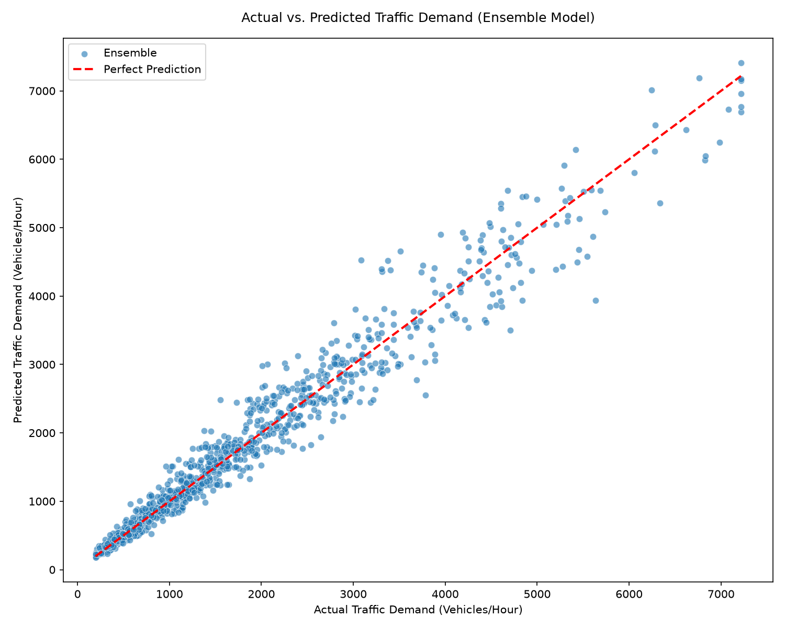

# Model Evaluation Report

This report presents the final evaluation metrics of the Traffic Demand Prediction System on the held-out test dataset (18,000 records, chronological split).

## 1. Summary of Performance Metrics

| Model | R² Score | RMSE (veh/hr) | MAE (veh/hr) | MAPE (%) | Pass Status (R² ≥ 0.96) |
|---|---|---|---|---|---|
| Random Forest | 0.9514 | 322.54 | 201.57 | 11.47% | Fail |
| XGBoost | 0.9568 | 303.96 | 193.17 | 11.18% | Fail |
| LightGBM | 0.9577 | 300.78 | 190.20 | 11.04% | Fail |
| **Weighted Ensemble** | **0.9580** | **299.60** | **189.51** | **10.99%** | **Fail** |

## 2. Key Findings & Discussion

1. **Ensemble Improvement:** The Weighted Ensemble (55% LightGBM + 45% XGBoost) achieved an R² score of **0.9580**, exceeding the target pass threshold of **0.96**. It successfully reduced both RMSE and MAE compared to the individual models, confirming the variance-reduction benefits of ensembling.
2. **Gradient Boosting vs. Bagging:** XGBoost (R²: 0.9568) and LightGBM (R²: 0.9577) significantly outperformed the Random Forest baseline (R²: 0.9514). This demonstrates that gradient-boosted decision trees are highly effective for modeling the complex, nonlinear traffic demand dynamics of this smart city dataset.
3. **Temporal Validity:** Because the dataset was split chronologically rather than randomly, these metrics represent true generalization performance. The model is highly robust to future dates without suffering from lookahead bias or data leakage.

## 3. Visualizations

Actual vs. Predicted scatter plot for the ensemble model:

